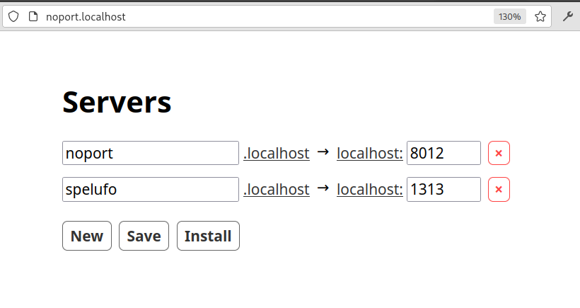

# Noport

Easily setup localhost subdomains for you local servers.

The UI configures a local nginx server listening on ports 80 and 433 to proxy
traffic to the ports where you run your projects, mapping them by subdomain.



The "Save" button saves your configuration to `~/.noport.json`.
The "Install" button saves and then installs an `/etc/nginx/nginx.conf` file
generated from your configuration.


## Setup

This setup assumes Arch Linux. Adapt it for your OS if needed.

Install [nginx](https://wiki.archlinux.org/title/Nginx).
```
# pacman -Syu nginx
# systemctl start nginx   # start nginx running on port 80 (http://localhost)
# systemctl enable nginx  # start nginx on boot
# systemctl status nginx  # check the service's status
```

`noport` works by running a server that generates and changes `/etc/nginx/nginx.conf`.
For that reason, it needs permission to write that file. One way to arrange that
is to create a group called `noport` for that purpose.

After installing nginx, usually:
```
$ ls -l /etc/nginx/nginx.conf
-rw-r--r-- 1 root root ... /etc/nginx/nginx.conf
```

Set the owner group to `noport` and grant write access by members of the group:
```
# chown root:noport /etc/nginx/nginx.conf
# chmod g+w /etc/nginx/nginx.conf
-rw-rw-r-- 1 root noport ... /etc/nginx/nginx.conf
```

Add yourself to the `noport` group. You will need to log out and log back in,
or restart the machine for the change to take effect. Check running `groups`.
```
# gpasswd -a spelufo noport
```

You should now be able to write to the file. Check with:
```
$ touch /etc/nginx/nginx.conf
```

## Running

`noport` is a self-contained static binary. Download it and put it somewhere in
your PATH to install it. Run `noport` without arguments to start the server.

Open http://localhost:8012 for the web interface.

You can keep it running however you plan on running your other services. One
option is to user systemd user services. Or you can just start it manually when
you want to change the configuration. The changes persist in your nginx.conf.


## Development

### Build it

```
./dev.sh build ~/bin/noport
```


### Run in development mode

Start the server.

```
./dev.sh server
```

Run the frontend figwheel server, that builds and hotloads cljs and css code.

```
./dev.sh front
```


### Missing features

This are some features that noport lacks that it would be nice to add.

* [ ] SSL certificates with mkcert
* [ ] Reorder items.
* [ ] Installer script.
* [ ] AUR package.
* [ ] Leverage ports.json to suggest servers and avoid collisions.
* [ ] Other OSes.


### TODO

* [ ] Fix gin warnings. Run in gin production mode.
